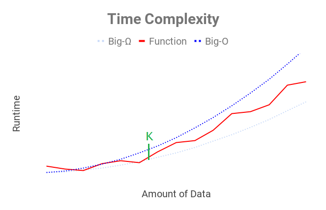

# Time Complexity, Part 1: Intro to Big-O

Written by <b>Adil S. Iqbal</b>.
 

Published on <b>June 3, 2019</b>.
 

When I think of the term "Time Complexity," I think of the Star Trek episode where Jean-Luc Picard had to travel through time to destroy a cosmic anomaly. Thankfully, the term actually refers to something a whole lot simpler.

<blockquote>All that really belongs to us is time; even he who has nothing else has that.

- Baltasar Gracian
</blockquote>

Consider this question: If you were living in New York City, what would be the best way of getting to Los Angeles? I hope you didn't say "walking." Right now, the best way to go from NYC to LA is to fly there by airplane. If it were possible, most of us would just teleport. People value their time, so they'd like to travel fast to preserve it. The same holds true for algorithms. We want them to be as fast as possible. Time complexity analysis helps us *judge* how fast our algorithms can work.

Notice, I used the word "judge" and not "measure." You can measure how fast your car is going by looking at the odometer. However, that information doesn't tell you much about the car itself. How does your car handle on city roads? highways? or rough terrain? How long can your car drive before it breaks down? Measuring an algorithm's speed is useful, but it doesn't give you a good idea of the whole picture.

To judge our algorithm's speed, we need to do an analysis of our code. Since we are going to talk about code analysis in upcoming articles, lets first try to understand, on a gut level, why we analyze the way we do.

<blockquote>It is a capital mistake to theorize before one has data.

- Sherlock Holmes
</blockquote>

Think back to our car analogy. The speed of a car can be measured in miles per hour. "Miles" refers to a *distance* and "hour" refers to a unit of *time*. When we're judging our algorithm, we're not really talking about distance; our code is not going to sprout legs and run away from us. In most cases, our algorithms are processing *data*. It takes a car longer to travel across the *country *than it would to travel across a *town*; likewise, the more data an algorithm has to process, the more time the algorithm will need to process it.

Let's do a fun thought experiment. Let's pretend that we've written a function. Let's now time that function as we run it with larger and larger data-sets. We then plot those times on a graph with the x-axis representing the amount of data that the function has to churn through and the y-axis that represents the amount of time it takes for the function to complete it's defined tasks. That graph might look something like this (the red line represents our function):

<blockquote>We demand rigidly defined areas of doubt and uncertainty!

- Douglas Adams
</blockquote>

If you wanted to buy a car, and you wanted to judge how fast the car could go - would you feel more confident about your judgement if you took it for a test drive around the *block *or around the *city*? Personally, the more road I get to drive on, the better I would feel about my judgement. Similarly, when judging the speed of an algorithm we really only care about how it handles a *large *amount of data. That helps us be more sure about what we're thinking. In the graph above, we really only care about how our function performs after point $k$.

Back to the car analogy: No matter how much we test drive our car, no matter how confident we feel about our judgement, we are really only making a *guess *and hoping that we're in the ballpark of what the actual speed might be. When it comes to judging algorithms, it's the same concept. We are not actually measuring the speed of the algorithm - we're judging it based on where we think the *ballpark* is going to be. The two dotted blue lines in the above graph represents the ballpark. The top blue line is the *slowest *the function could be and the bottom blue line is the *fastest *the function could be.

In this fun thought experiment, we *pretended* to measure the time it takes for our function to perform given larger and larger data-sets. In the real world, all we really have to make our initial judgement are the blue lines. In the upcoming articles, we'll talk about how to determine where those lines might be using time complexity analysis.

<blockquote>The optimist proclaims that we live in the best of all possible worlds; and the pessimist fears this is true.

- James Branch Cabell
</blockquote>

The most common type of time complexity analysis is called Big-O analysis. When we talk about Big-O analysis, we're really just trying to reason about one of the blue lines in that graph above. Specifically, the top blue line: the one that represents the *slowest *we think our algorithm can perform.

You might be asking yourself, "Why do folks only care about the slowest my algorithm will perform?" To answer that, let's reason by analogy: Person A and Person B both have the exact same commute time of 30 minutes and are both required to arrive at work by 9:00 AM. But there is one big difference:

* Person A leaves their home at 8:30 AM so they can arrive at work by 9:00 AM exactly.
* Person B leaves their home at 7:30 AM so they can arrive at work an hour early, by 8:00 AM.

Both people will usually arrive on time but over the course of a few years, Person A will be late more often then Person B. Person B will then be seen as more reliable. Why? Because Person B took into account all the bad things that could slow him down in the morning. In the same way, when we do a Big-O analysis, we need to take account of all the bad things that can happen to our algorithms that could potentially slow them down. In so doing, we can be confident that our judgement is *reliable*.

<blockquote>From a certain point onward, there is no turning back. That is the point that must be reached.

- Franz Kafka
</blockquote>

Let's summarize what we've talked about:

* Time Complexity analysis helps us judge how fast an algorithm will perform. We are not actually measuring the speed of the algorithm directly.
* When analyzing our algorithms in this way, we only care about how the speed of our algorithm changes as the data-sets become very large.
* When performing Big-O analysis, we need to take into account all the bad things that can happen to slow our algorithm down.

In the next article, we're going to discuss how the runtime of our algorithm scales as we feed it more and more data. We also build some of the vocabulary necessary to do our first Big-O analysis!